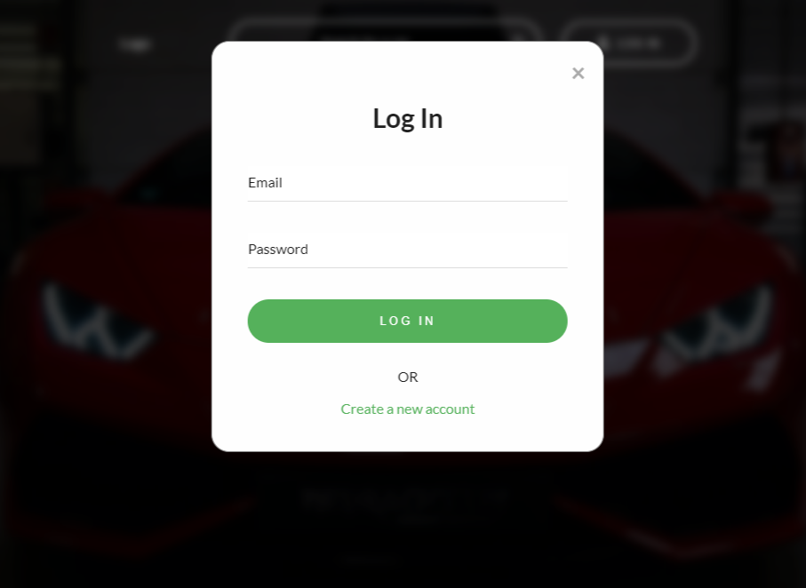

# V8 Car Reviews 

## Deployment

Website deployed at https://v8-car-reviews.herokuapp.com/

## Description

A website that allows users to log in and review cars.

## Table of contents

- [Installation](#installation)
- [Usage](#usage)
- [License](#license)
- [Languages](#languages)
- [Creators](#creators)
- [Screenshot](#screenshot)

## Installation

- install the dependencies: \
  `npm i`

- create the database with root access: \
  `mysql -u root -p` \
  `<enter password>`

- in MySQL: \
  `source db/schema.sql` \
  `quit`

- seed database: \
  `npm run seed`

## Usage

`npm start`

## License

This is covered under The MIT License:

## Languages

- 
- 
- 
- 
- **`Sequlize.js`**
- 

## Creators

our github:

- https://github.com/dan297
- https://github.com/LewisChatham
- https://github.com/jjcourtney/

## Screenshot

